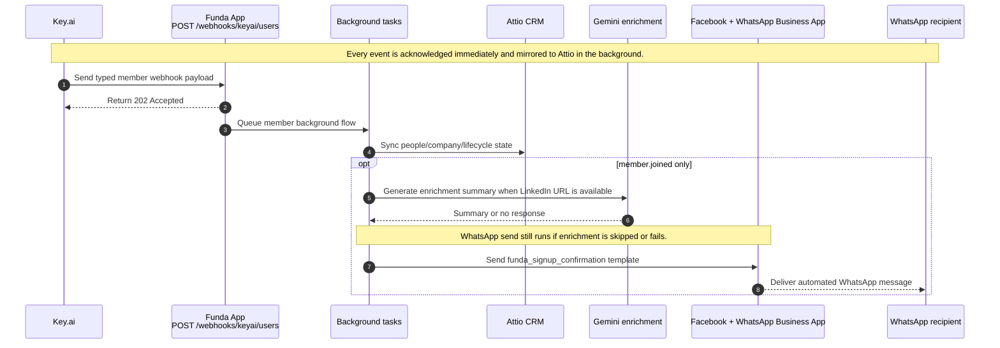

# High-Level Invocation Flow

This diagram intentionally stays high level. It shows the one public webhook
endpoint, the immediate `202` acknowledgement returned for every event, and the
extra background flow used for `member.joined`.

