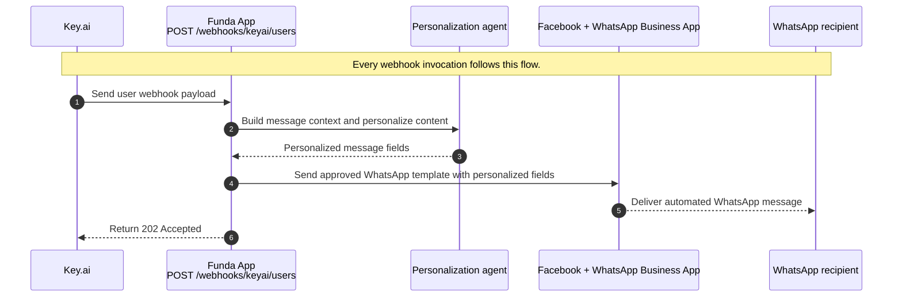

# High-Level Invocation Flow

This diagram intentionally stays high level. It shows the one public webhook endpoint and the message flow that should happen on each invocation.

```mermaid
sequenceDiagram
    autonumber
    participant KeyAI as Key.ai
    participant Endpoint as Funda App<br/>POST /webhooks/keyai/users
    participant Agent as Personalization agent
    participant WABA as Facebook + WhatsApp Business App
    participant Recipient as WhatsApp recipient

    Note over KeyAI,Recipient: Every webhook invocation follows this flow.
    KeyAI->>Endpoint: Send user webhook payload
    Endpoint->>Agent: Build message context and personalize content
    Agent-->>Endpoint: Personalized message fields
    Endpoint->>WABA: Send approved WhatsApp template with personalized fields
    WABA-->>Recipient: Deliver automated WhatsApp message
    Endpoint-->>KeyAI: Return 202 Accepted
```
