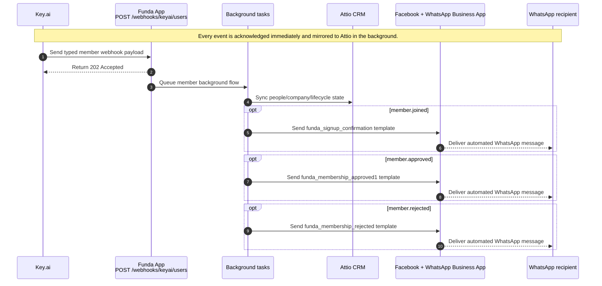

# High-Level Invocation Flow

This diagram intentionally stays high level. It shows the one public webhook
endpoint, the immediate `202` acknowledgement returned for every event, the
Attio sync that runs for all member events, and the WhatsApp steps for the
currently supported lifecycle events.

